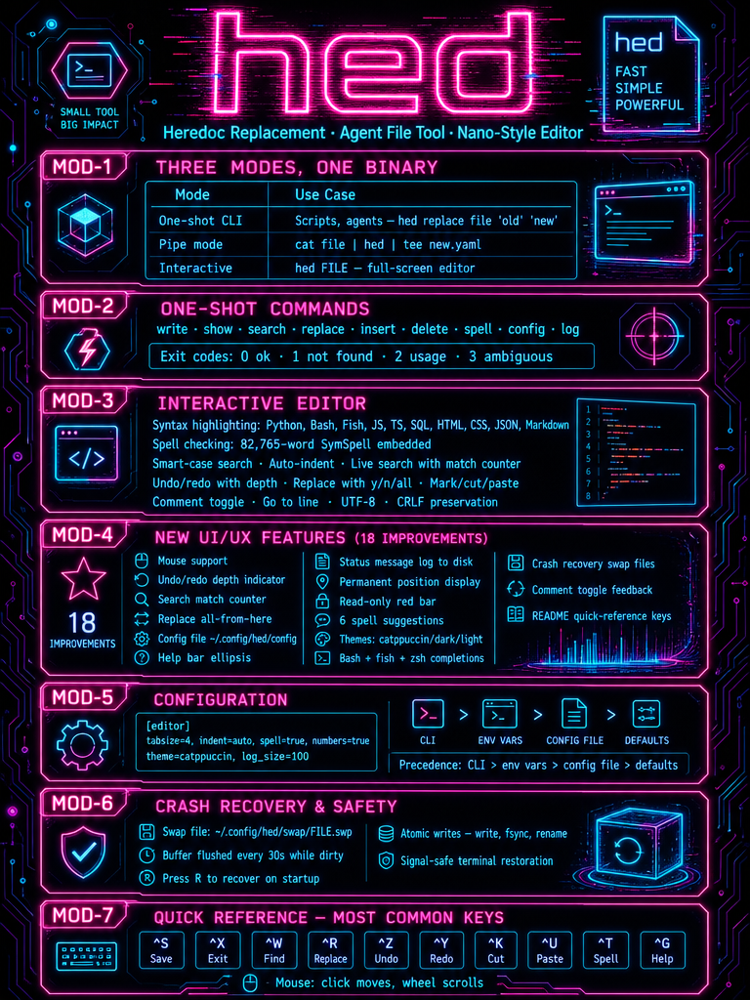
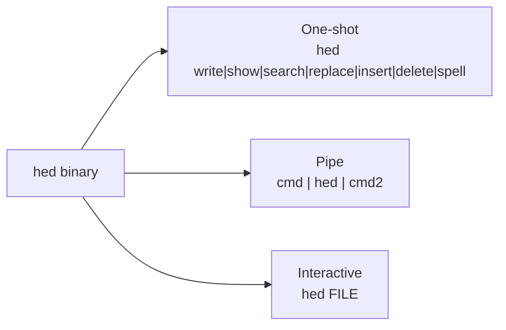

# hed

> A heredoc replacement, agent-friendly file tool, and nano-style editor — all in one static C++17 binary with zero runtime dependencies.



---

## Overview

**hed** is three tools in a single executable:

1. **Heredoc replacement** — `hed write FILE` accepts stdin or `-c 'text'`, writes atomically, and behaves identically in bash, zsh, and fish (which has no heredocs).
2. **Agent-friendly one-shot tool** — `show`, `search`, `replace`, `insert`, `delete`, and `spell`. Never prompts, prints a unified diff of every change, refuses ambiguous edits, and uses meaningful exit codes for scripting.
3. **Nano-style editor** — `hed FILE` opens a full-screen editor with syntax highlighting, live search, replace, undo/redo, mark/cut/paste, comment toggling, and an interactive spell checker. `cmd | hed | cmd2` works like `vipe`.

**Syntax highlighting:** Python, Bash/sh/zsh (including heredoc bodies), fish, JavaScript, TypeScript, SQL, HTML (with embedded `<script>`/`<style>`), CSS/SCSS, JSON, Markdown.

**Spell checking:** 82,765-word SymSpell frequency dictionary embedded in the binary, with suggestion ranking by edit distance + word frequency, suffix/prefix awareness, contraction handling, a built-in tech vocabulary, and a personal dictionary. In code, only comments and string literals are checked — identifiers, paths, URLs, camelCase, and ACRONYMS are skipped.

**No runtime dependencies:** no ncurses, no hunspell, no data files.

---

## Three modes at a glance



| Mode | Use case | Example |
|------|----------|---------|
| **One-shot** | Scripts, agents, automation — never prompts, machine-readable exit codes | `hed replace app.py 'retries = 3' 'retries = 5'` |
| **Pipe** | Edit text in a pipeline — reads stdin, writes result to stdout on exit | `git log -1 --format=%B \| hed` |
| **Interactive** | Full-screen editing with highlighting, search, undo, spell check | `hed src/main.cpp` |

---

## Platform Support

| Platform | Status | Notes |
|----------|--------|-------|
| **Linux** | ✅ Native | Primary target. `make && sudo make install` |
| **macOS** | ✅ Supported | Intel & Apple Silicon. `g++` (Homebrew) or `clang++` (Xcode CLT). No `-static` flag. |
| **Windows (WSL)** | ✅ Native | WSL is Linux — works out of the box. |
| **Windows (native)** | ❌ Not supported | No Win32 terminal API support. Use WSL. |

**macOS requirements:** Xcode Command Line Tools (`xcode-select --install`) or Homebrew (`brew install g++`).

## Build & install

**Requirements:** g++ ≥ 9 or clang++ ≥ 10 (C++17). No other dependencies.

```bash
make                 # build ./hed
make test            # run the test suite (32 shell checks + 12 PTY editor tests)
sudo make install    # install to /usr/local/bin/hed + bash, fish & zsh completions
make static          # fully static, stripped binary — Linux only
```

Other targets:

| Target | Description |
|--------|-------------|
| `make uninstall` | Remove installed binary and completions |
| `make clean` | Remove build artifacts |

---

## Quick start

### One-shot commands

```bash
# Write (heredoc replacement) — literal text, atomic, works in bash/zsh/fish
hed write config.yaml <<'EOF'
key: value
EOF

# Same thing in fish or bash: indented single-quoted block, dedented automatically
hed write -p -m 755 ~/bin/hello -d -c '
    #!/usr/bin/env bash
    echo "hello $USER"
'

# Show with line numbers and a range
hed show app.py -n -r 40:+20

# Search (grep-style, with context)
hed search 'def main' src/*.py -C 2

# Replace — must match exactly once unless --all or --nth
hed replace app.py 'retries = 3' 'retries = 5'
hed replace app.py 'print(' 'log(' --all --expect 7 -b

# Insert after a matching line
hed insert app.py --after-match 'import os' -c 'import sys'

# Delete a line range
hed delete app.py --range 88:90

# Spell check — exits 1 if typos found
hed spell README.md
git log -1 --format=%B | hed spell
```

### Pipe mode

```bash
# Edit piped text in the editor; result goes to stdout
cat config.yaml | hed | tee config.yaml.new

# Filter through an editor step
git diff | hed | grep '^+' > additions.txt
```

### Interactive mode

```bash
# Open a file for editing (nano-like)
hed src/main.cpp

# Open at a specific line and column
hed src/main.cpp +42:10

# Force a language, disable spell underlining
hed notes.txt --lang markdown --no-spell

# View-only mode
hed /etc/hosts -R
```

---

## Exit codes

| Code | Meaning |
|------|---------|
| `0` | Success |
| `1` | No match found, or misspellings detected |
| `2` | Usage error or I/O error |
| `3` | Ambiguous match, or `--expect` count mismatch (nothing written) |

---

## Editor keys

### Most common keys (quick reference)

`^S` save · `^X` exit · `^W` search · `^G` help · `^Z`/`^Y` undo/redo · `^K`/`^U` cut/paste · `^R` replace · `^T` spell · `^O` save as · `^Q` quit/abort

Mouse: **click** moves the cursor, **scroll wheel** scrolls. The status bar always shows `Ln X, Col Y` plus undo/redo depth.

| Key | Action | Key | Action |
|-----|--------|-----|--------|
| `^S` | Save | `^O` | Save as |
| `^X` | Exit (prompts to save) | `^Q` | Quit / abort |
| `^W` / `^F` | Live search (smart-case) | `^N` / `^P` | Next / previous match |
| `^R` or `^\\` | Replace (y/n/a) | `^_` / `^L` | Go to line[:col] |
| `^K` | Cut line (repeat to collect) or selection | `^U` | Paste |
| `^^` or `M-A` | Set mark (select) | `M-6` | Copy |
| `^Z` / `^Y` | Undo / redo | `M-3` | Toggle comment |
| `M-Up` / `M-Down` | Move line | `M-D` | Duplicate line |
| `^T` or `F7` | Spell walk (1–6 pick, `a` add, `i` ignore, `e` edit) | `M-S` | Toggle spell underline |
| `Tab` / `Shift-Tab` | Indent / outdent (selection too) | `M-N` | Toggle line numbers |
| `^G` / `F1` | Help | Mouse | Click moves cursor, wheel scrolls |

**Also:** auto-indent (language-aware extra indent after `:`, `{`, `then`, `function`…), smart Home, bracketed paste, UTF-8/wide characters, CRLF preservation, indentation style detection, `+LINE:COL` on the command line, and crash recovery via swap files (`~/.config/hed/swap/`).

**Editor feedback:** live search shows a `match X of Y` counter; replace prompts show `(X of Y)` plus a context snippet (`ln N: …pre [MATCH] post…`); undo/redo report remaining depth (`U n R n`); comment toggling reports the affected line range; the title bar truncates long filenames with an ellipsis and turns into a solid **red bar** in read-only mode; the help bar truncates labels with an ellipsis on narrow terminals.

**Configuration:** editor settings (tab size, indent style, spell, line numbers, syntax theme, log size) live in `~/.config/hed/config` — view or edit them with `hed config`. Three syntax themes are available: `catppuccin`, `dark`, and `light`. Status messages are logged to `~/.config/hed/log/` and shown with `hed log`.

**Shell completions:** `make install` installs tab-completion for **bash**, **fish**, and **zsh** (all commands, options, languages, and theme values). `hed langs --help` lists the supported languages.

---

## License

hed is released under the **MIT License** — see [`LICENSE`](LICENSE).

The only bundled third-party material is the SymSpell English frequency dictionary (MIT, © Wolf Garbe) — see [`NOTICE`](NOTICE).
