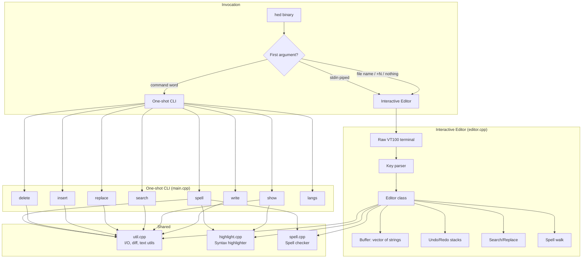
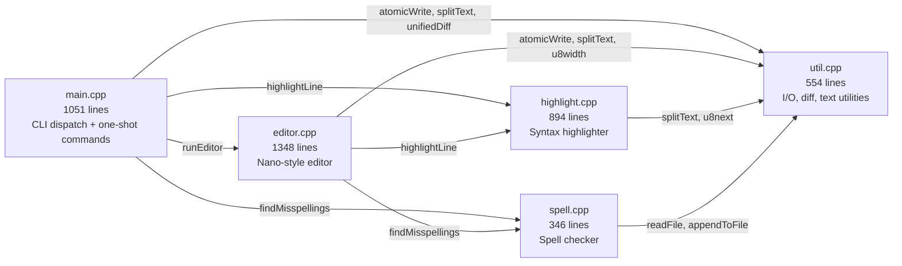
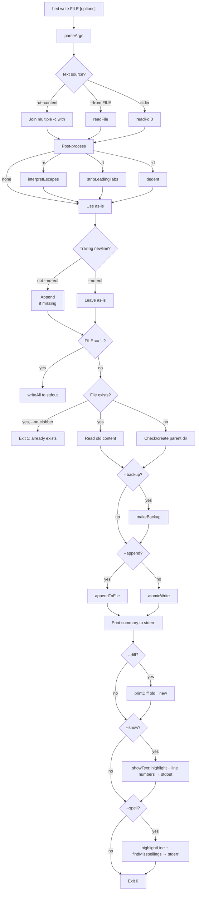
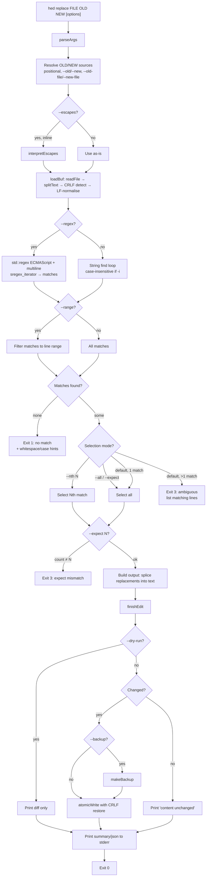
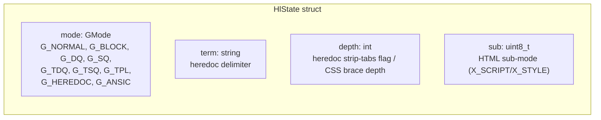
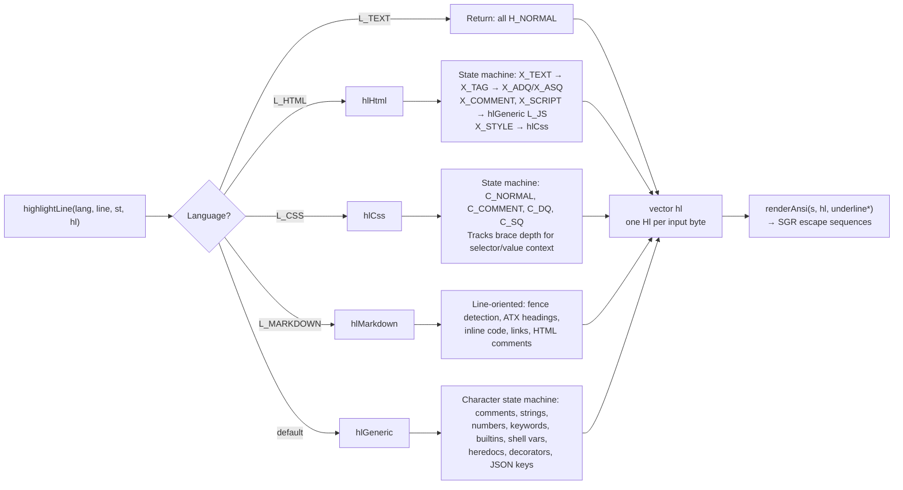
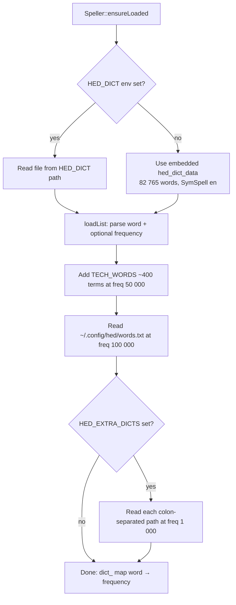
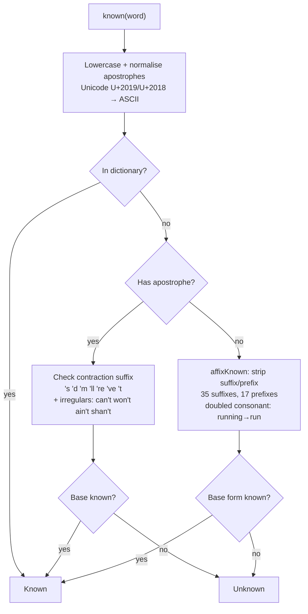
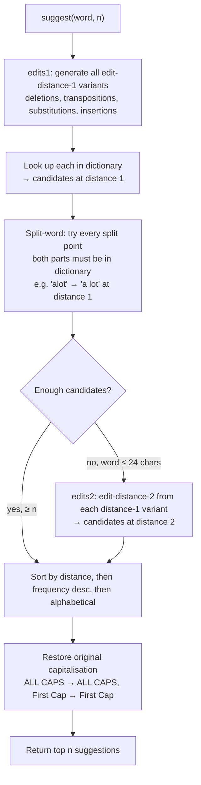

# hed — Architecture

`hed` is a C++17 file-editing tool that combines three interfaces into one binary:
a **one-shot CLI** (script/agent-friendly, never prompts), a **pipe mode** (edit piped
text interactively, emit result on stdout), and a **nano-style full-screen editor**
(raw VT100/xterm escape sequences, no ncurses). It also embeds a SymSpell-based
spell checker and a syntax highlighter for 11 languages.

---

## 1. System Overview



### Three Modes

| Mode | Trigger | Behaviour |
|---|---|---|
| **One-shot CLI** | `hed <command> [args]` | Parses args, performs operation, prints result, exits. Never prompts. Safe for scripts/agents. |
| **Pipe mode** | `cmd \| hed` or `cmd \| hed \| cmd2` | Opens the interactive editor on the terminal. On `^X`, writes the buffer to stdout. On `^Q`, aborts with exit 1. |
| **Interactive editor** | `hed [FILE] [+LINE[:COL]]` | Full-screen nano-like editor. Opens FILE (or empty buffer), saves with `^S`, exits with `^X`. |

---

## 2. Module Breakdown



### main.cpp — CLI Dispatch & One-shot Commands

- **Argument parser** (`parseArgs`): Supports `--long`, `-s`, `-sVALUE`, `--long=VALUE`, `--` end-of-options. Global `--color=auto|always|never` and `--no-color`.
- **Command dispatch** (`main`): Routes to `cmdWrite`, `cmdShow`, `cmdSearch`, `cmdReplace`, `cmdInsert`, `cmdDelete`, `cmdSpell`, or `cmdEdit`.
- **Shared helpers**: `getText` (resolves `-c`/`--from`/stdin), `resolveLang` (explicit `--lang` or auto-detect), `showText` (highlighted output), `printDiff` (unified diff).
- **FileBuf**: Used by replace/insert/delete. Holds `raw` (on-disk bytes), `text` (LF-normalised), and `crlf` flag. `loadBuf` normalises CRLF→LF; `toDisk` converts back.
- **finishEdit**: Shared epilogue for replace/insert/delete — handles `--dry-run`, `--backup`, `--json`, `--quiet`, diff printing.

### editor.cpp — Nano-style Editor

- **Editor class**: All state in one class — buffer (`vector<string> L`), cursor (`cx`, `cy`), scroll offsets (`rowoff`, `coloff`), undo/redo stacks, clipboard, mark, search state, spell state.
- **Terminal layer**: Raw VT100/xterm. `enableRaw()` sets termios raw mode, enters alternate screen (`\x1b[?1049h`), enables bracketed paste (`\x1b[?2004h`). `restoreTerm()` on exit.
- **Key parser** (`readKey`): Reads bytes, handles ESC sequences (CSI, SS3, Alt+key). Returns key codes. Supports arrow keys, Home/End, PgUp/PgDn, Delete, F1–F12, Ctrl+arrows, Alt+arrows, bracketed paste.
- **Rendering** (`refresh`): Builds the entire screen in a single string buffer, then one `writeAll`. Title bar, text rows with line numbers, bottom help/status bar. Cursor positioned at end.
- **Highlighting cache** (`hlStart`, `hlValid`): Per-line `HlState` array. `lineHl(y)` computes highlight for line `y` by replaying states from `hlValid` forward. `invalidate(y)` truncates cache on edit.
- **Undo/Redo**: Snapshot-based. Each snapshot stores `{L, cx, cy, ver}`. Coalesces rapid same-line edits within 1.5 s. Depth limit scales with buffer size (500 for small, 10 for >4 MB).
- **Editing ops**: `insertByte`, `newline` (with auto-indent for Python/brace/shell/fish), `backspace` (with smart dedent), `tab`/`dedentLines`, `cut`/`copy`/`paste`, `toggleComment`, `moveLine`, `dupLine`.
- **Search**: `find` (prompt with live preview), `findNext`, `replace` (interactive y/n/a). Smart-case: lowercase query = case-insensitive.
- **Spell walk** (`spellWalk`): Iterates misspellings, offers suggestions (1–9), add-to-dictionary, ignore, edit, or skip.
- **Pipe mode**: When stdin/stdout is not a TTY, opens `/dev/tty` for the editor UI. On `^X`, writes buffer to stdout. On `^Q`, exits with code 1.

### highlight.cpp — Syntax Highlighter

- **Language definitions** (`LangDef`): Static table of 11 languages. Each has: name, aliases, extensions, filenames, interpreters, line/block comments, keyword/type/builtin/constant sets, and feature flags (`pyStrings`, `shell`, `fish`, `backtick`, `decorators`, `multilineStrings`, `sqlQuotes`, `json`).
- **Three highlighters**:
  - `hlGeneric`: For Python, Bash, Fish, JS, TS, SQL, JSON. Character-by-character state machine.
  - `hlCss`: Separate state machine for CSS/SCSS/LESS.
  - `hlHtml`: HTML/XML with embedded `<script>` and `<style>` (delegates to `hlGeneric`/`hlCss`).
  - `hlMarkdown`: Line-oriented (fences, headings, inline code, links, comments).
- **Highlight types** (`Hl` enum): `H_NORMAL`, `H_COMMENT`, `H_STRING`, `H_NUMBER`, `H_KEYWORD`, `H_TYPE`, `H_BUILTIN`, `H_FUNCTION`, `H_VARIABLE`, `H_CONSTANT`, `H_TAG`, `H_ATTR`, `H_PREPROC`, `H_ESCAPE`, `H_PROPERTY`, `H_OPERATOR`.
- **Output**: `highlightLine` fills a `vector<uint8_t>` (one byte per input byte). `hlSgr` maps each type to an SGR escape sequence. `renderAnsi` produces the final string with optional underline overlays.

### spell.cpp — Spell Checker

- **Dictionary**: Embedded SymSpell `frequency_dictionary_en_82_765.txt` (82,765 words, MIT, Wolf Garbe). Linked at build time via `hed_dict_data`/`hed_dict_end` symbols. Overridable with `HED_DICT` env var.
- **Additional word sources**: `TECH_WORDS` (built-in ~400 tech terms at frequency 50 000), `~/.config/hed/words.txt` (user dictionary, freq 100 000), `HED_EXTRA_DICTS` (colon-separated paths, freq 1 000).
- **Singleton**: `Speller::instance()` — loaded once on first use via `ensureLoaded()`.
- **Known-word check** (`known`): Lowercases, normalises apostrophes (Unicode → ASCII). Checks dictionary, contractions (`'s`, `'d`, `'m`, `'ll`, `'re`, `'ve`, `'t`), irregular negatives (`can't`, `won't`), and affix stripping (`affixKnown` — 35 suffix rules, 17 prefix rules, doubled-consonant handling).
- **Suggestion algorithm** (`suggest`): Damerau-Levenshtein edit-distance-1 candidates first, then split-word suggestions (`"alot"` → `"a lot"`), then edit-distance-2 (only if word ≤ 24 chars and not enough distance-1 results). Ranked by (edit distance, frequency desc, alphabetical). Preserves original capitalisation.
- **Word extraction** (`findMisspellings`): Uses highlight output to determine which regions are checkable (`spellRegion`). In code: only comments and strings. In prose (text, markdown, HTML): all normal text. `checkChunk` skips code-ish tokens (paths, URLs, identifiers with `_/\@$=<>{}[]` etc.), words < 3 letters, ALL-CAPS acronyms, and camelCase identifiers.

### util.cpp — Utilities

- **Text**: `splitText` (splits on `\n`, detects CRLF), `joinText` (reconstructs with correct line endings), `splitSimple`.
- **I/O**: `readFd`, `readFile`, `writeAll`, `pathExists`, `isDir`, `dirName`, `baseName`.
- **Atomic write** (`atomicWrite`): `mkstemp` in target directory → `writeAll` → `fsync` → `fchmod` (preserves existing file's mode, or uses `0666 & ~umask`) → `fchown` (best-effort, preserves owner) → `rename`. Falls back to in-place write if directory not writable. Resolves symlinks before writing.
- **Append** (`appendToFile`): `O_WRONLY|O_CREAT|O_APPEND`.
- **Backup** (`makeBackup`): Timestamped copy `YYYYMMDDHHMMSS-NAME` in same directory.
- **Diff** (`unifiedDiff`): Myers algorithm with 3000-edit limit. Falls back to delete-all-insert-all for very different files. Produces unified diff with configurable context.
- **UTF-8**: `u8next`, `u8prev`, `u8width` (uses `wcwidth`), `displayWidth`.
- **Escapes** (`interpretEscapes`): `\n`, `\t`, `\r`, `\0`, `\a`, `\b`, `\e`, `\f`, `\v`, `\\`, `\'`, `\"`, `\xHH`, `\uHHHH`, `\UHHHHHHHH`.
- **Indent**: `dedent` (strips common leading whitespace), `stripLeadingTabs`.
- **Range parsing** (`parseRange`): `N`, `A:B`, `A:`, `:B`, `A:+N`, `-N:` (last N lines).
- **JSON**: `jsonEscape`.
- **Config**: `homeDir`, `configDir` (`~/.config/hed` or `$XDG_CONFIG_HOME/hed`).

---

## 3. Data Flow Diagrams

### 3.1 Write Command



### 3.2 Replace Command



### 3.3 Editor Rendering Pipeline

```mermaid
flowchart TD
    A[refresh called] --> B[scroll: adjust rowoff/coloff to keep cursor visible]
    B --> C[Build string buffer ab]
    C --> D["Hide cursor: \\x1b[?25l"]
    D --> E[drawTitle: filename, dirty flag, Ln/Col, lang, spell, mark]
    E --> F[For each visible screen row r]
    F --> G[drawRow: line number gutter + text]
    G --> H[lineHl: get highlight for line]
    H --> I{hlValid >= line?}
    I -->|yes| J[Use cached HlState]
    I -->|no| K[Replay: highlightLine from hlValid to line<br/>store intermediate HlStates]
    K --> J
    J --> L[highlightLine: fill vector uint8_t with Hl values]
    L --> M[lineSpell: findMisspellings on this line]
    M --> N[Build overlay vector: spell underline, search match, selection]
    N --> O[Render chars: SGR colour per Hl, tab expansion, ctrl chars, UTF-8 width]
    O --> P[Truncate at screen edge, add '>' indicator]
    P --> Q[Clear to EOL: \\x1b[K]
    Q --> R[drawBottom: status message + help key bar]
    R --> S[Position cursor: cy-rowoff+2, rx-coloff+gutter+1]
    S --> T["Show cursor: \\x1b[?25h"]
    T --> U[writeAll: single write to terminal]
```

---

## 4. Syntax Highlighting Architecture

### 4.1 HlState — Cross-Line State



`HlState` is carried across lines so that multi-line constructs (block comments,
triple-quoted strings, heredocs, CSS blocks, HTML `<script>`/`<style>`) are
highlighted correctly. The editor caches a `vector<HlState> hlStart` — one entry
per line — and a `hlValid` counter. When line `y` is needed, the highlighter
replays from `hlValid` to `y`, storing intermediate states. On edit, `invalidate(y)`
truncates the cache at the edit point.

### 4.2 Language Detection

```mermaid
flowchart TD
    A[detectLang path, content] --> B{path has filename match?}
    B -->|yes| C[Return that language]
    B -->|no| D{path has extension match?}
    D -->|yes| C
    D -->|no| E{Content starts with #!?}
    E -->|yes| F[Parse shebang: extract interpreter<br/>strip env, flags, version suffixes]
    F --> G{Interpreter match?}
    G -->|yes| C
    G -->|no| H[Content sniffing]
    E -->|no| H
    H --> I{Starts with <!doctype html / <html / <?xml?}
    I -->|yes| J[L_HTML]
    I -->|no| K{First non-ws char is { or [?<br/>and last non-ws is } or ]?}
    K -->|yes| L{Next non-ws is quote/}/] ?}
    L -->|yes| M[L_JSON]
    L -->|no| N[L_TEXT]
    K -->|no| N
```

Detection priority: exact filename → file extension → shebang interpreter → content sniffing → plain text.

### 4.3 Highlight Pipeline



### 4.4 Spell Region Filtering

The highlighter also drives the spell checker. `spellRegion(lang, hl)` determines
which highlight types are spell-checkable:

| Language | Checkable regions |
|---|---|
| `L_TEXT` | Everything |
| `L_MARKDOWN` | Normal text, keywords, comments, operators |
| `L_HTML` | Normal text, comments (not tags/attributes) |
| `L_JSON` | String values only |
| All others (code) | Comments and string literals only |

---

## 5. Spell Checker Architecture

### 5.1 Dictionary Loading



### 5.2 Known-Word Check



### 5.3 Suggestion Algorithm



### 5.4 Word Extraction

```mermaid
flowchart TD
    A["findMisspellings(sp, lang, line, hl, allText)"] --> B[Scan line for checkable regions<br/>using spellRegion on highlight output]
    B --> C[For each contiguous checkable chunk]
    C --> D[checkChunk: trim surrounding punctuation]
    D --> E{Chunk contains code-ish chars?<br/>_ / \ @ $ = < > { } [ ] | ` ~ ^ * # % & + : ; ( ) . "}
    E -->|yes| F[Skip: path, URL, identifier, email, number]
    E -->|no| G[Extract words: letters + internal apostrophes]
    G --> H{Word filters}
    H -->|< 3 letters| I[Skip: too short]
    H -->|ALL CAPS| J[Skip: acronym]
    H -->|camelCase| K[Skip: identifier]
    H -->|passes filters| L{sp.known word?}
    L -->|yes| M[Not a misspelling]
    L -->|no| N[Add to Misspelling list<br/>start, length, word]
```

---

## 6. Key Design Decisions

### 6.1 No ncurses — Raw VT100/xterm

The editor uses raw terminal escape sequences directly instead of ncurses/termcap.
This eliminates an external dependency and gives full control over rendering.

- **Terminal setup**: `tcgetattr`/`tcsetattr` with `TCSAFLUSH`. Disables `BRKINT`,
  `ICRNL`, `INPCK`, `ISTRIP`, `IXON`, `OPOST`, `ECHO`, `ICANON`, `IEXTEN`, `ISIG`.
  Sets `VMIN=1`, `VTIME=0` for blocking reads.
- **Alternate screen**: `\x1b[?1049h` on enter, `\x1b[?1049l` on exit.
- **Bracketed paste**: `\x1b[?2004h` on enter, `\x1b[?2004l` on exit. Paste content
  is read until `\x1b[201~` terminator.
- **Signal safety**: `atexit(restoreTerm)` plus `SIGTERM`/`SIGHUP`/`SIGSEGV`/`SIGABRT`
  handlers that restore the terminal before re-raising. `SIGWINCH` sets a flag
  checked in the main loop.
- **Single-write rendering**: The entire screen is built in one `std::string` and
  written with a single `writeAll` call, avoiding flicker.

### 6.2 Atomic Writes

All file modifications go through `atomicWrite`:

1. Resolve symlinks (`realpath`) so we write through to the real file.
2. `mkstemp` in the target file's directory (same filesystem for atomic rename).
3. `writeAll` → `fsync` → `fchmod` (preserve mode or use umask default) → `fchown` (best-effort preserve owner).
4. `rename` over the target (atomic on POSIX).
5. On any failure: `unlink` the temp file, return error.
6. Fallback: if `mkstemp` fails (directory not writable), fall back to `open(O_WRONLY|O_CREAT|O_TRUNC)` in-place write.

This ensures readers never see a partially-written file, and the old content is
preserved if the write fails.

### 6.3 CRLF Preservation

Files with Windows line endings are handled transparently:

- `splitText` detects CRLF (all `\n` preceded by `\r`) and strips `\r` from line content.
- All internal processing (search, replace, highlight, spell) uses plain `\n`.
- `joinText` and `toDisk` re-insert `\r\n` if the original file was CRLF.
- The editor's `crlf` flag is set from `splitText` and used when saving.
- Replace/insert/delete all use `FileBuf` which normalises on load and restores on write.

### 6.4 Exit Codes

| Code | Constant | Meaning |
|---|---|---|
| 0 | `EX_OK` | Success |
| 1 | `EX_NOTFOUND` | No match found, file not found, misspellings found, `--no-clobber` violation |
| 2 | `EX_USAGE` | Usage error, I/O error, bad arguments |
| 3 | `EX_AMBIG` | Ambiguous match (multiple occurrences without `--all`/`--nth`), `--expect` mismatch |

These are consistent across all one-shot commands, making `hed` scriptable:
`if hed search pattern file; then ... fi` works as expected.

### 6.5 Additional Decisions

- **No external dependencies**: Pure C++17 standard library + POSIX. No ncurses,
  no ICU, no Boost. The dictionary is embedded at build time.
- **Singleton spell checker**: `Speller::instance()` loads the dictionary once
  on first use. All commands and the editor share the same instance.
- **Highlighting cache in editor**: Per-line `HlState` array avoids re-highlighting
  the entire buffer on each keystroke. Only the edited line and subsequent lines
  are re-computed.
- **Undo coalescing**: Rapid edits on the same line within 1.5 seconds are merged
  into a single undo step. Undo depth scales inversely with buffer size.
- **Smart-case search**: Lowercase queries are case-insensitive; queries with
  uppercase are case-sensitive. Works in both one-shot `search` and editor `find`.
- **Unified diff**: Myers algorithm with a 3000-edit limit. For very different
  files, falls back to delete-all-insert-all. Used by `replace`, `insert`,
  `delete`, and `write --diff`.
