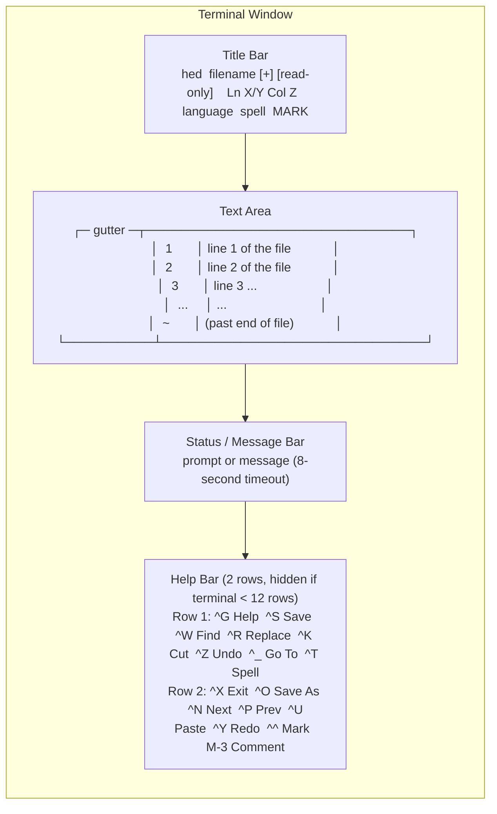

# hed Editor Guide

A complete reference for the `hed` interactive editor — a nano-style, full-screen text editor built into the `hed` binary. It uses raw VT100/xterm escape sequences (no ncurses dependency) and provides syntax highlighting, live search, replace, undo/redo, mark/cut/paste, comment toggling, and an interactive spell checker.

---

## 1. Overview

`hed` is a single static C++17 binary that serves three roles:

1. **Heredoc replacement** — `hed write FILE` takes stdin or `-c 'text'` and writes atomically.
2. **One-shot file tool** — `show`, `search`, `replace`, `insert`, `delete`, `spell` commands for scripts and agents.
3. **Nano-style editor** — `hed FILE` opens a full-screen interactive editor.

The editor supports:

- **Syntax highlighting** for Python, Bash/sh/zsh, fish, JavaScript, TypeScript, SQL, HTML (with embedded `<script>`/`<style>`), CSS/SCSS, JSON, and Markdown.
- **Spell checking** with an embedded 82,765-word SymSpell English frequency dictionary. In code, only comments and string literals are checked; identifiers, paths, URLs, camelCase, and acronyms are skipped.
- **Pipe mode** — `cmd | hed | cmd2` works like `vipe`.
- **UTF-8 / wide character** support, **CRLF preservation**, **bracketed paste**, **auto-indentation**, and **indentation style detection**.
- **No runtime dependencies** — no ncurses, no hunspell, no data files.

---

## 2. Editor Layout



### Layout Details

| Region | Rows | Description |
|---|---|---|
| **Title bar** | 1 | Filename, dirty flag `[+]`, read-only flag, cursor position `Ln X/Y Col Z`, language name, spell status, mark status. Long filenames are truncated with a leading `…` marker. In read-only mode the whole row is drawn as a solid **red bar** (white on red). |
| **Text area** | `rows - 2 - helpRows` | Line-number gutter (auto-width, min 3 chars + space) + file content. `~` marks lines past end of file. `>` at right edge indicates truncated lines. |
| **Status bar** | 1 | Active prompt (bold) or message (yellow, 8-second timeout). The right side **always** shows the cursor position `Ln X, Col Y` (plus undo/redo depth `U n R n` when no prompt is active), even while a message is displayed. |
| **Help bar** | 0 or 2 | Two rows of key bindings. Hidden entirely if terminal has fewer than 12 rows. In pipe mode, `^X Exit` becomes `^X Done` and `^Q Abort` appears. On narrow terminals, labels are truncated with an ellipsis (a label is dropped entirely if it cannot fit). |

---

## 3. Key Binding Reference

Key notation: `^X` = Ctrl+X, `M-X` = Alt+X (or Esc then X), `^\` = Ctrl+Backslash.

### 3.1 File Operations

| Key | Action |
|---|---|
| `^S` | Save to current filename |
| `^O` | Save as (prompts for filename; confirms overwrite if file exists) |
| `^X` | Exit editor. If buffer is modified, asks `Save modified buffer? Y Yes / N No / Esc Cancel`. In pipe mode, writes buffer to stdout and exits. |
| `^Q` | Quit / abort. If buffer is modified, asks `Discard unsaved changes and quit? Y Yes / N No`. In pipe mode, exits with code 1 without writing. |
| `^G` or `F1` | Show built-in help screen (press any key to return) |

### 3.2 Search & Replace

| Key | Action |
|---|---|
| `^W` or `^F` | Live search. As you type, the first match is highlighted and the status bar shows a `match X of Y` counter. `Up`/`Down` or `^N`/`^P` inside the prompt cycle through matches. `Enter` confirms (the counter stays visible), `Esc`/`^C`/`^Q`/`^G` cancels. |
| `^N` or `F3` | Jump to next match of last search |
| `^P` | Jump to previous match of last search |
| `^R` or `^\\` | Replace. Prompts for search text, then replacement. At each match the prompt shows `(X of Y)` (which occurrence) plus a context snippet — `ln N: "…pre [MATCH] post…"` — then `Y` yes, `N` no, `A` all, `Esc` cancel. |

**Smart-case search:** if the search string is all lowercase, matching is case-insensitive. If it contains any uppercase, matching is case-sensitive.

### 3.3 Movement

| Key | Action |
|---|---|
| `←` `→` | Move cursor left / right (UTF-8 aware) |
| `↑` `↓` | Move cursor up / down (preserves visual column) |
| `Home` | Smart Home: first press jumps to first non-whitespace, second press jumps to column 0 |
| `End` | Jump to end of line |
| `^A` | Same as `Home` (smart) |
| `^E` | Same as `End` |
| `PgUp` | Move up one page (scrolls viewport) |
| `PgDn` | Move down one page (scrolls viewport) |
| `Ctrl+Left` | Move to previous word boundary |
| `Ctrl+Right` | Move to next word boundary |
| `Ctrl+Home` or `M-\` | Jump to top of file (line 1, col 0) |
| `Ctrl+End` or `M-/` | Jump to bottom of file (last line, end) |
| `^_` or `^L` or `M-G` | Go to line[:column]. Accepts `N`, `N:C`, negative N (counts from end). Commas are accepted as column separators. |

### 3.4 Editing

| Key | Action |
|---|---|
| `^K` | Cut line (with trailing newline). Repeated `^K` presses accumulate lines in the clipboard. If a selection is active, cuts the selection instead. |
| `^U` | Paste clipboard contents at cursor |
| `M-6` or `M-^` | Copy current line (with trailing newline) or copy selection to clipboard |
| `^^` (Ctrl+6) or `M-A` | Set/clear mark. When mark is set, moving the cursor creates a selection. |
| `Tab` | Insert indentation at cursor. If selection spans multiple lines, indent all lines. |
| `Shift+Tab` | Remove one level of indentation from current line or all selected lines |
| `^Z` or `M-U` | Undo. The status bar reports the remaining undo depth, e.g. `Undo (3)`. |
| `^Y` or `M-E` | Redo. The status bar reports the remaining redo depth, e.g. `Redo (2)`. |
| `^D` or `Delete` | Delete character forward (or join with next line at end) |
| `Backspace` or `^H` | Delete character backward (or join with previous line at start). When on whitespace-only prefix, removes up to the previous indent boundary. |
| `M-Up` | Move current line up |
| `M-Down` | Move current line down |
| `M-D` | Duplicate current line |
| `M-3` or `M-#` | Toggle comment on current line or selection. Uses language-appropriate comment style. The status bar reports the affected range, e.g. `Commented lines 3-5` / `Uncommented lines 3-5`. |
| `Esc` | Clear mark, search highlight, and status message |
| Mouse | Click moves the cursor; scroll wheel scrolls. The status bar always shows `Ln X, Col Y` plus undo/redo depth. |

### 3.5 Spell Checking

| Key | Action |
|---|---|
| `^T` or `F7` | Spell walk — jump to next misspelled word. Prompts with up to 6 suggestions. |
| `M-S` | Toggle misspelling underline on/off |

**Spell walk keys** (active during `^T`/`F7` prompt):

| Key | Action |
|---|---|
| `1`–`6` | Replace with suggestion N |
| `a` | Add word to personal dictionary (`~/.config/hed/words.txt`) |
| `i` | Ignore word for this session |
| `e` | Edit word manually (prompts for replacement) |
| `n` or `Space` | Skip to next misspelling |
| `Esc` | Stop spell walk |

### 3.6 View

| Key | Action |
|---|---|
| `M-N` | Toggle line-number gutter |
| Mouse | Click moves cursor, wheel scrolls |

### 3.7 Help Bar (bottom of screen)

The help bar shows two rows of the most common bindings. It is hidden when the terminal has fewer than 12 rows. On narrow terminals, labels are truncated with an ellipsis (`…`); a label is dropped entirely if it cannot fit in its slot.

**Row 1:** `^G Help` · `^S Save` · `^W Find` · `^R Replace` · `^K Cut` · `^Z Undo` · `^_ Go To` · `^T Spell`

**Row 2 (normal mode):** `^X Exit` · `^O Save As` · `^N Next` · `^P Prev` · `^U Paste` · `^Y Redo` · `^^ Mark` · `M-3 Comment`

**Row 2 (pipe mode):** `^X Done` · `^Q Abort` · `^N Next` · `^P Prev` · `^U Paste` · `^Y Redo` · `^^ Mark` · `M-3 Comment`

---

## 4. Auto-Indent Rules

When you press `Enter`, the editor copies the current line's leading whitespace to the new line. It may also add extra indentation or insert a dedented closing bracket, depending on the language.

### 4.1 Extra Indent Triggers

| Language | Trigger | Example |
|---|---|---|
| **Python** | Line ends with `:` | `def foo():` → next line indented |
| **JavaScript, TypeScript, CSS, JSON, Bash** | Line ends with `{`, `[`, or `(` | `if (x) {` → next line indented |
| **SQL** | Line ends with `{`, `[`, or `(` | `SELECT (SELECT ...` → next line indented |
| **Bash** | Line ends with ` then` or ` do`, or is exactly `then` or `do` | `if true; then` → next line indented |
| **Fish** | Line starts with `function `, `if `, `for `, `while `, `switch `, `case `, `else`, or is exactly `begin` | `function foo` → next line indented |

### 4.2 Auto-Dedent on Closing Bracket

In brace languages (JS, TS, CSS, JSON, Bash), if you type `}` at the beginning of a line (only whitespace before it) and the line contains only whitespace, the editor automatically removes one indentation level. This keeps closing braces aligned with their opening constructs.

### 4.3 Auto-Dedent on Open+Close

When you press `Enter` after an opening bracket and the next character is the matching closing bracket (e.g., `{|}`), the editor inserts three lines: the indented content line, the closing bracket at the original indentation, and positions the cursor on the middle line.

### 4.4 Indentation Style Detection

The editor auto-detects indentation from file content (first 2000 lines):

- Counts lines starting with tabs vs. spaces.
- Among space-indented lines, counts those with 2-space and 4-space multiples.
- Uses tabs if tab-indented lines outnumber space-indented lines.
- Otherwise picks 2-space if 2-space multiples dominate, else 4-space.
- **Bash/Fish override:** if only tabs are found, uses tabs.

### 4.5 Default Indent Width by Language

| Language | Default Width |
|---|---|
| JavaScript, TypeScript, HTML, CSS, JSON, Markdown | 2 spaces |
| Python, Bash, Fish, SQL, Text | 4 spaces |

---

## 5. Pipe Mode

Pipe mode activates automatically when stdin or stdout is not a terminal, or when no filename is given and data is piped in. The editor opens `/dev/tty` for interactive input/output.

### Usage

```bash
# Edit piped data, write result to stdout
cat file.txt | hed | less

# Filter through the editor (like vipe)
git log -1 --format=%B | hed | git commit -F -

# Edit and save back to a file
cat config.yaml | hed > config.yaml.new
```

### Pipe Mode Behavior

| Key | Action |
|---|---|
| `^X` | Finish editing — writes the buffer to stdout and exits with code 0 |
| `^Q` | Abort — exits with code 1, nothing written to stdout |

The title bar shows `[pipe]` instead of a filename. The help bar's second row shows `^X Done` and `^Q Abort` instead of `^X Exit` and `^O Save As`.

---

## 6. Command-Line Options

### 6.1 Opening a File

```bash
hed [FILE] [+LINE[:COL]] [options]
```

| Option | Description |
|---|---|
| `FILE` | File to open. If omitted and stdin is not a terminal, enters pipe mode. |
| `+LINE` | Open at line `LINE`. Negative values count from end of file. |
| `+LINE:COL` | Open at line `LINE`, column `COL`. |
| `-l`, `--lang LANG` | Force language for syntax highlighting (overrides auto-detection). See `hed langs` (or `hed langs --help`) for valid values. |
| `-T`, `--tabsize N` | Tab display width (default: 4). |
| `--tabs` | Indent with tabs (overrides auto-detection). |
| `--spaces N` | Indent with `N` spaces (overrides auto-detection). |
| `--no-spell` | Start with spell underlining disabled. |
| `--no-numbers` | Hide line-number gutter. |
| `-R`, `--readonly` | Open in read-only mode (editing keys are disabled). |

### 6.2 Examples

```bash
# Open file at line 42
hed app.py +42

# Open at line 10, column 5
hed app.py +10:5

# Open with JavaScript highlighting forced
hed script.txt -l javascript

# Open with 2-space indentation
hed app.py --spaces 2

# Open read-only
hed /etc/hosts -R

# Pipe mode (implicit when stdin is not a terminal)
cat data.json | hed | jq .
```

### 6.3 Language Auto-Detection

When `--lang` is not specified, the editor detects language from:

1. **Filename** — exact match against known filenames (e.g., `.bashrc`, `PKGBUILD`, `README`).
2. **File extension** — matched against known extensions (e.g., `.py`, `.js`, `.ts`, `.sql`, `.html`, `.css`, `.json`, `.md`).
3. **Shebang** — first line `#!` interpreter name (e.g., `#!/usr/bin/env python` → Python).
4. **Content sniffing** — `<!DOCTYPE html` / `<html` / `<?xml` → HTML; `{...}` or `[...]` with quoted keys → JSON.

---

## 7. Tips and Tricks

### 7.1 Efficient Editing

- **Cut multiple lines:** Press `^K` repeatedly to accumulate lines in the clipboard, then move and `^U` to paste them all.
- **Select and cut:** Set mark with `^^` or `M-A`, move cursor to extend selection, then `^K` to cut the selection.
- **Select and copy:** Set mark, move cursor, then `M-6` to copy the selection.
- **Quick comment/uncomment:** Select multiple lines and press `M-3` to toggle comments on all of them at once.
- **Move lines:** Use `M-Up`/`M-Down` to shift the current line up or down without cut/paste.
- **Duplicate lines:** `M-D` instantly duplicates the current line below.

### 7.2 Navigation

- **Smart Home:** Press `Home` to jump to the first non-whitespace character; press again to go to column 0.
- **Word movement:** `Ctrl+Left`/`Ctrl+Right` jump by word boundaries (alphanumeric + underscore + UTF-8).
- **Top/bottom:** `Ctrl+Home` or `M-\` jumps to the very top; `Ctrl+End` or `M-/` jumps to the very bottom.
- **Go to line:** `^_` or `^L` or `M-G` prompts for a line number. Use negative numbers to count from the end (e.g., `-5` = 5th from last line).

### 7.3 Search & Replace

- **Live search:** Start typing in the `^W` prompt — matches highlight as you type. Use `Up`/`Down` to cycle without pressing Enter. The status bar shows a `match X of Y` counter that stays visible after you confirm.
- **Smart-case:** Search is case-insensitive when your query is all lowercase, case-sensitive when it contains uppercase. No need for a flag.
- **Replace with context:** Each `^R` prompt shows `(X of Y)` plus a context snippet — `ln N: "…pre [MATCH] post…"` — so you can confirm you are replacing the right occurrence.
- **Replace all:** In the `^R` replace prompt, press `A` at any match to auto-replace all remaining occurrences.
- **Search wraps:** If no match is found forward, the search wraps to the beginning of the file (and vice versa). The status bar shows `Search wrapped`.

### 7.4 Spell Checking

- **Interactive walk:** `^T` or `F7` starts a spell walk. At each misspelling, you get up to 6 suggestions. Press `1`–`6` to pick one, `a` to add the word to your personal dictionary, `i` to ignore it this session, `e` to type a custom replacement, or `n`/`Space` to skip.
- **Personal dictionary:** Words added with `a` are saved to `~/.config/hed/words.txt` and remembered across sessions.
- **Toggle underline:** `M-S` toggles the red underline on misspelled words without stopping the spell walk.
- **Code vs. prose:** In source code files, only comments and string literals are checked. In Markdown and HTML, text content is checked. Identifiers, paths, URLs, camelCase, and acronyms are always skipped.

### 7.5 Working with Different File Types

- **CRLF files:** The editor detects CRLF line endings and preserves them on save.
- **UTF-8 / wide characters:** Cursor movement, column counting, and display all handle multi-byte UTF-8 and wide (CJK) characters correctly.
- **Binary files:** If the file contains NUL bytes, a warning is shown in the status bar.
- **Large files:** Undo history depth adapts to file size: 500 snapshots for small files, 50 for files over 1 MB, 10 for files over 4 MB.

### 7.6 Undo/Redo

- **Undo:** `^Z` or `M-U`. Consecutive edits on the same line within 1.5 seconds are grouped into a single undo step. The status bar reports the remaining depth, e.g. `Undo (3)`.
- **Redo:** `^Y` or `M-E`. Any new edit clears the redo stack. The status bar reports the remaining depth, e.g. `Redo (2)`.
- **Depth indicator:** when no prompt is active, the status bar's right side shows `U n R n` (remaining undo/redo steps).
- **Undo restores cursor position:** Each snapshot stores the full buffer state, cursor position, and version number.

### 7.7 Prompt Behavior

At any prompt (search, replace, save-as, go-to-line, etc.):

| Key | Action |
|---|---|
| `Enter` | Confirm |
| `Esc` or `^C` or `^Q` or `^G` | Cancel |
| `Backspace` or `^H` | Delete last character |
| `^U` | Clear entire input |
| `Up` / `Down` / `^N` / `^P` | Context-dependent (cycle matches in search, history in some prompts) |
| Bracketed paste | Paste text (first line only in prompts) |

### 7.8 Customization via Environment

| Variable | Effect |
|---|---|
| `HED_DICT` | Replace the built-in spell dictionary |
| `HED_EXTRA_DICTS` | Colon-separated list of extra word list files (one word per line, optional frequency) |
| `NO_COLOR` | Disable color output (auto color mode) |
| `TERM=dumb` | Disable color output (auto color mode) |

---

## 8. Built-in Help

Press `^G` or `F1` inside the editor to see the built-in help screen. It summarizes all key bindings and pipe-mode behavior. Press any key to return to the editor.

---

## 9. Summary of All Keys

| Key | Action |
|---|---|
| `^S` | Save |
| `^O` | Save as |
| `^X` | Exit (asks to save) |
| `^Q` | Quit / abort |
| `^G` / `F1` | Help |
| `^W` / `^F` | Find (live, smart-case) |
| `^N` / `F3` | Next match |
| `^P` | Previous match |
| `^R` / `^\` | Replace (y/n/all) |
| `^K` | Cut line / selection |
| `^U` | Paste |
| `M-6` / `M-^` | Copy line / selection |
| `^^` / `M-A` | Set/clear mark |
| `^Z` / `M-U` | Undo |
| `^Y` / `M-E` | Redo |
| `^_` / `^L` / `M-G` | Go to line[:col] |
| `^T` / `F7` | Spell walk |
| `M-S` | Toggle spell underline |
| `M-N` | Toggle line numbers |
| `M-3` / `M-#` | Toggle comment |
| `M-D` | Duplicate line |
| `M-Up` | Move line up |
| `M-Down` | Move line down |
| Mouse | Click moves cursor, wheel scrolls |
| `^A` / `Home` | Smart home |
| `^E` / `End` | End of line |
| `Ctrl+Home` / `M-\` | Top of file |
| `Ctrl+End` / `M-/` | Bottom of file |
| `Ctrl+Left` | Word left |
| `Ctrl+Right` | Word right |
| `^D` / `Delete` | Delete forward |
| `Backspace` / `^H` | Delete backward |
| `Tab` | Indent |
| `Shift+Tab` | Outdent |
| `Esc` | Clear mark/highlight/message |
| `←` `→` `↑` `↓` | Cursor movement |
| `PgUp` / `PgDn` | Page up / down |

---

## 10. Configuration, status log & crash recovery

### 10.1 Configuration file

Editor settings live in `~/.config/hed/config` (or `$XDG_CONFIG_HOME/hed/config`), an INI-style file with an `[editor]` section:

```ini
[editor]
tabsize = 4
indent = auto        # auto | tabs | spaces
spaces = 4
spell = true
numbers = true
theme = catppuccin   # built-in or a custom theme (see 10.2)
log_size = 100       # 0 = unlimited
```

View or edit it with `hed config`:

```
hed config              # print the file path and effective settings
hed config get theme    # print one setting
hed config set theme dark   # set and save
```

Precedence (highest first): **command-line flags > `HED_*` environment variables > config file > defaults**. The environment variables are `HED_TABSIZE`, `HED_INDENT`, `HED_SPACES`, `HED_SPELL`, `HED_NUMBERS`, `HED_THEME`, and `HED_LOG_SIZE`.

### 10.2 Custom themes

Three themes are built in — `catppuccin` (default), `dark`, and `light` — and you can add your own without recompiling. The quickest way is to generate a template from the current theme and edit it:

```bash
hed theme create mytheme
$EDITOR ~/.config/hed/themes/mytheme.theme   # or wherever $XDG_CONFIG_HOME points
hed config set theme mytheme
```

`hed theme` lists every available theme (built-in + custom). A theme file is INI-style with a `[theme]` section; each key maps a highlight type to the numeric part of an SGR escape sequence (the editor wraps values in `ESC[<value>m`):

```ini
[theme]
comment = 3;38;5;244    # italic + grey
string  = 38;5;114      # 256-colour blue
number  = 38;5;215
```

The recognised keys are `comment`, `string`, `number`, `keyword`, `type`, `builtin`, `function`, `variable`, `constant`, `tag`, `attr`, `preproc`, `escape`, `property`, `operator`. Values may combine attributes and colours (`1;31` = bold red, `3;38;5;244` = italic grey). Missing keys fall back to catppuccin. If the selected theme file is missing or malformed, hed warns on stderr and falls back to catppuccin. A custom theme with the same name as a built-in overrides it.

### 10.3 Status message log

Every status message is appended to `~/.config/hed/log/YYYY-MM-DD.log` (one file per day) and kept in an in-memory ring buffer sized by `log_size`. Show the last N messages with:

```
hed log          # last 50 messages from today
hed log 10       # last 10
hed log -n 5     # same
```

### 10.4 Crash recovery (swap files)

While editing a named file, hed keeps a swap file at `~/.config/hed/swap/FILENAME.swp`. The buffer is flushed to it every ~30 seconds while dirty, so a crash (kill, power loss, terminal close) loses at most 30 seconds of edits. On the next start, if the swap file is newer than the original file, hed shows **"Swap file found, press R to recover"** — press `R` to restore the swap content, or any other key to discard it. The swap file is removed on a clean exit.

### 10.5 Shell completions

`make install` installs tab-completion for **bash**, **fish**, and **zsh**. Completions cover all commands, their options, the language identifiers, and the theme values (`catppuccin`, `dark`, `light`). The zsh completion also completes `config get`/`set` keys and `--lang`/`--theme` values.

### 10.6 Missing-terminal error

If the editor is launched without a usable terminal (e.g. from a script or agent with no TTY), hed prints a clear message and exits 2, pointing you to the one-shot commands instead:

```
hed: interactive editor needs a terminal (/dev/tty unavailable).
Use a one-shot command instead, e.g.:  hed write FILE ...  |  hed show FILE  |  hed replace FILE OLD NEW
```
